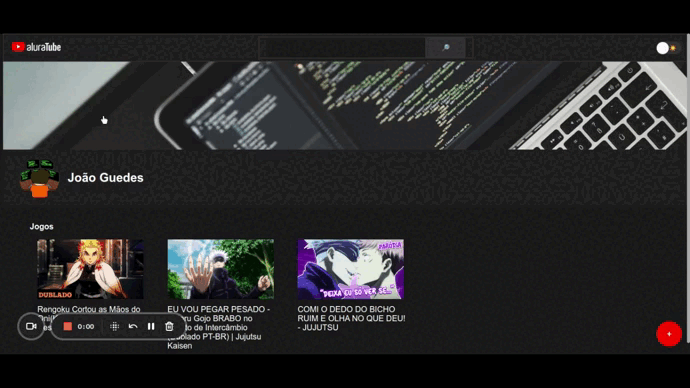

<h1 align="center">     AluraTube</h1>

<p align="center">
Imersão React no desenvolvimento de projeto baseado no <a href="https://www.youtube.com/">YouTube</a>.
</p>
<p align="center">
  <a href="#rocket-tecnologias">Tecnologias</a>&nbsp;&nbsp;&nbsp;|&nbsp;&nbsp;&nbsp;
  <a href="#computer-projeto">Projeto</a>&nbsp;&nbsp;&nbsp;|&nbsp;&nbsp;&nbsp;
  <a href="#art-layout">Layout</a>&nbsp;&nbsp;&nbsp;|&nbsp;&nbsp;&nbsp;
  <a href="#memo-instalação">Instalação</a>&nbsp;&nbsp;&nbsp;|&nbsp;&nbsp;&nbsp;
  <a href="#plus-funcionalidades">Funcionalidades</a>&nbsp;&nbsp;&nbsp;|&nbsp;&nbsp;&nbsp;
  <a href="#unlock-licença">Licença</a>
</p>

<p align="center">
  
</p>

<br>

## :rocket: Ferramentas & Tecnologias

Esse projeto foi desenvolvido com as seguintes tecnologias:

- [HTML](https://developer.mozilla.org/pt-BR/docs/Web/HTML)
- [CSS](https://developer.mozilla.org/pt-BR/docs/Web/CSS)
- [React](https://pt-br.reactjs.org/)
- [JavaScript]()
- [JSON](https://www.json.org/json-pt.html)
- [Supabase](https://supabase.com/) 
- [Styled Components](https://styled-components.com/)


## :computer: Projeto

Projeto usando a framwork React para criação criação de um site siumlado o YouTube, utilizando de ferramentas como Supabase como banco de dados e o style-components para estilização das páginas javascript.

## :art: Layout

Você pode visualizar o layout do projeto através [DESSE LINK](https://www.figma.com/file/9le7aXThW9urLQIM96L7oG/Aluratube?node-id=0%3A1&t=mwNm8bd6tfqiRUP9-0). É necessário ter conta no [Figma](https://figma.com) para acessá-lo.

## :memo: Instalação

O arquivo `package.json` especifica as dependências em suas respectivas versões, para instalar basta ter o **NodeJS** instalado ou o **NPM** e executar o seguinte comando na raiz do projeto:
```
npm install
```
Após a instalação de todas as depêndências execute o seguinte comando para iniciar o projeto:


```
npm run dev
```

### Supabase
Para preparar o banco de dados acesse o site da [Supabase](https://supabase.com/) e crie uma conta, indico que utilize sua conta do [github](https://github.com/).

Após será necessário criar uma tabela `Video`, contendo as colunas: `id`, `created_at`, 
`titulo`, `url`, `thumb` e `playlist`.


Lembrar de desativar a opção "Enable Row Level Security (RLS)" e ativar a opção "Enable Realtime":


Por fim save!

Agora configure as credências no projeto nas páginas: `src/Components/RegisterVideo/index.js` e no `src/services/videoService.js`:
Alterando as seguintes variáveis:


## :ballot_box_with_check: Funcionalidades

- Basicamente o site apresenta uma lista de playlists recebida a partir dos dados no supabase que age como o banco de dados da aplicação porém de forma online;

- Possui um mecanismo de pesquisa funcional;

- Na parte de estilização temos a opção de tema **Light** e **Dark**;

- E a função de cadastro de novos vídeos com possibilidade para três tipos diferentes de playlists.

## :unlock: Licença

Esse projeto está sob a licença MIT.

---

Projeto construido durante a Imersão [Alura](https://www.alura.com.br/) 

